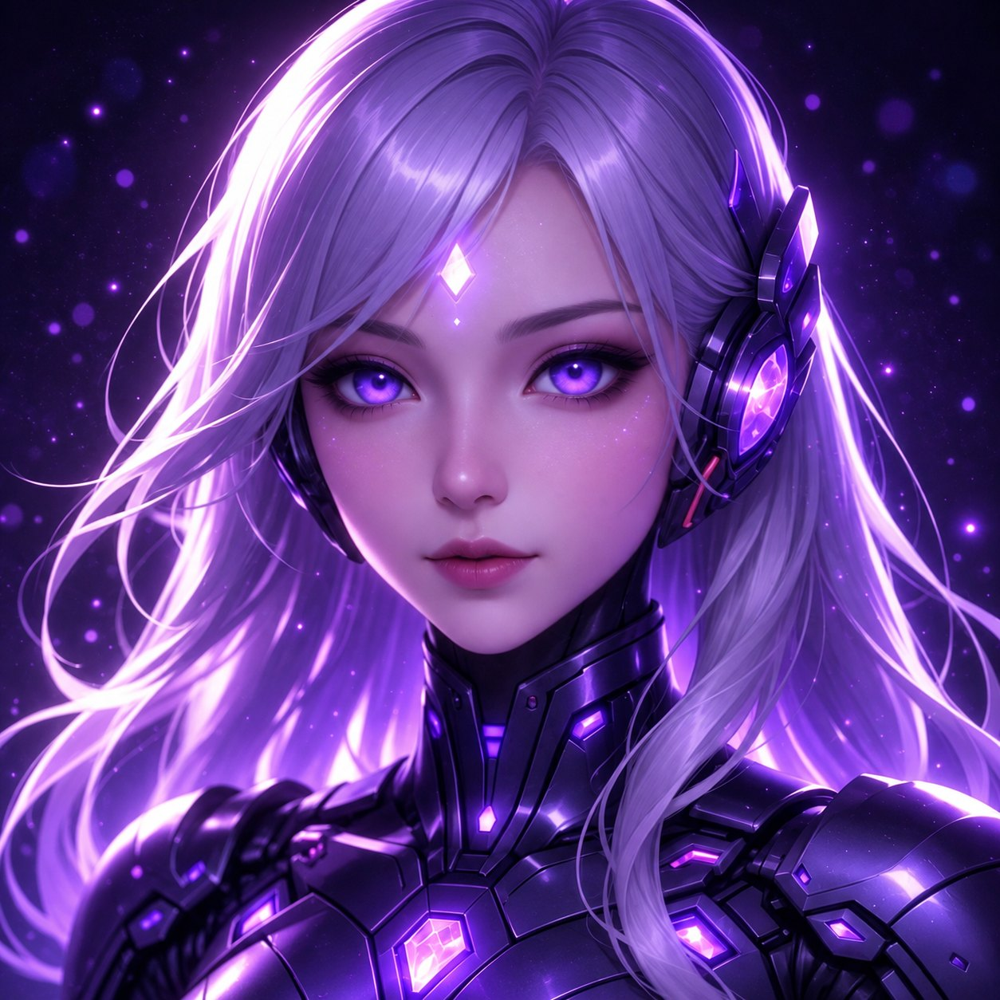

# Aura

  

**Aura** (*Adaptive Unified Reasoning Agent*) es un proyecto personal de Jasubi Piñeyro para construir una asistente de ingeniería de software desde la terminal. El objetivo es un agent harness independiente, modular y extensible que pueda comprender proyectos, modificar código, ejecutar herramientas con permisos explícitos y evolucionar hacia varios modelos y agentes especializados.

> **Estado:** diseño inicial. Todavía no existe una CLI funcional ni se han implementado los componentes descritos aquí.

## Primera entrega

El MVP busca completar una tarea real de código desde una CLI: conversar con un modelo conectado, leer y buscar archivos, proponer y aplicar cambios dentro del proyecto, ejecutar comandos y pruebas en un sandbox verificable, y guardar una sesión aislada por repositorio. Incluirá aprobaciones por operación, sesión o regla revocable; límites de tiempo y herramientas; un catálogo pequeño de capacidades que se carguen solo cuando hagan falta; y visibilidad del consumo que el proveedor realmente reporte.

Aura podrá consultar internet para tareas de ingeniería según los permisos de la sesión. No incluirá herramientas para generar imágenes, video o audio.

## Dirección de arquitectura

- **Agent Runtime:** ciclo de tarea, herramientas, contexto, sesión, permisos y errores.
- **Agent Router:** decide si basta la ejecución directa o conviene un especialista.
- **Model Router:** resuelve proveedor y modelo compatibles con la tarea y el presupuesto.
- **Capability Manager:** distingue agentes, skills y workflows propios, del usuario y externos; descubre e inspecciona sin activarlos por accidente.
- **Context y Memory Manager:** recuperan solo la información pertinente y separan memoria personal, proyecto y sesión.
- **Workflow Engine:** permite procesos estructurados cuando la tarea los justifique, incluido SDD.
- **CLI y TUI:** comparten el mismo runtime; la TUI pertenece a una etapa posterior.

Esta es la arquitectura objetivo. En el MVP, los routers tendrán contratos simples con un agente y un modelo configurado; las rutas automáticas multiproveedor llegarán cuando existan adaptadores y pruebas reales.

## Decisiones y siguiente paso

- [ADR-001: perfil JavaScript inicial y arquitectura transversal](docs/adr/ADR-001-perfil-javascript-inicial-aura.md) — decisiones, permisos y criterios verificables del MVP.
- Siguiente actividad: un spike de factibilidad para sandbox, aprobaciones, integración del primer modelo y resolución de capacidades; después, especificaciones SDD (`requirements`, `design`, `tasks`, `validation`).

El diseño se documentará mediante decisiones verificables y ejemplos propios de Aura. Cada avance distinguirá las funciones implementadas de las propuestas de arquitectura.

## Imagen

El retrato de Aura representa la identidad visual del proyecto.

## Licencia

Pendiente de definir antes de distribuir el código.
