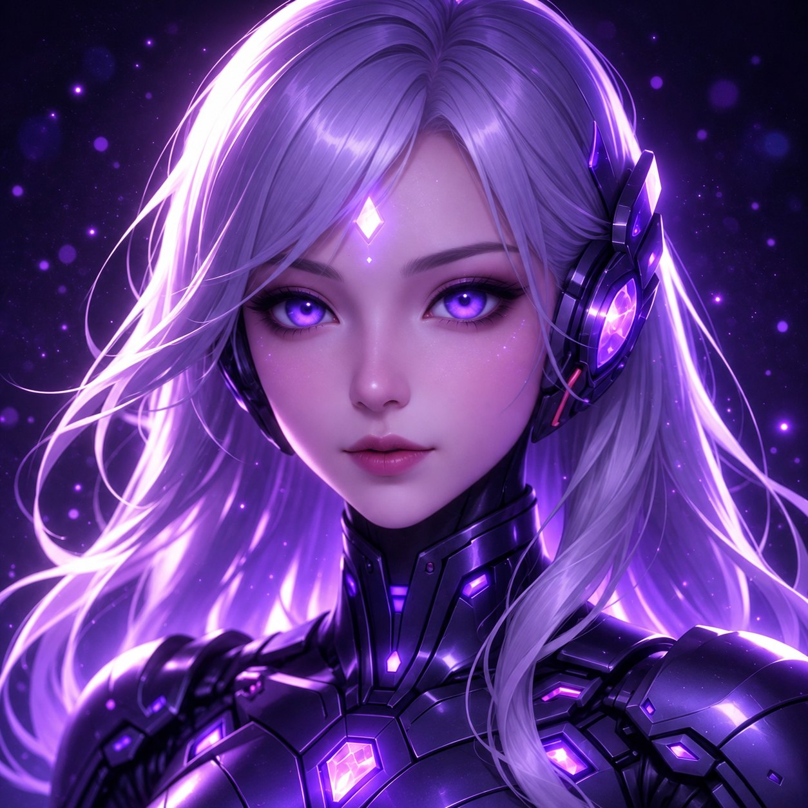

# Aura

  

**Aura** (*Adaptive Unified Reasoning Agent*) es un proyecto personal de Jasubi Piñeyro para construir una asistente de ingeniería de software desde la terminal. El objetivo es un agent harness independiente, modular y extensible que pueda comprender proyectos, modificar código, ejecutar herramientas con permisos explícitos y evolucionar hacia varios modelos y agentes especializados.

> **Estado:** especificación inicial del MVP macOS; todavía no existe una CLI funcional. Las integraciones y garantías de seguridad descritas dependen de pruebas de factibilidad.

## Primera entrega

El MVP es macOS-first, usa únicamente OpenAI con inicio de sesión OAuth y adopta la Opción B: Aura conserva su propio Agent Runtime, contexto, herramientas, permisos, presupuestos y sesiones. La prioridad es utilizar la suscripción ChatGPT/Codex mediante una integración directa y permitida, detrás del OpenAI Provider Adapter. No habrá fallback silencioso hacia una API facturada por tokens.

Aura podrá consultar internet para tareas de ingeniería según los permisos de la sesión. No incluirá herramientas para generar imágenes, video o audio.

## Dirección de arquitectura

- **Agent Runtime:** ciclo de tarea, herramientas, contexto, sesión, permisos y errores.
- **Agent Router:** decide si basta la ejecución directa o conviene un especialista.
- **Model Router:** resuelve proveedor y modelo compatibles con la tarea y el presupuesto.
- **Capability Manager:** distingue agentes, skills y workflows propios, del usuario y externos; descubre e inspecciona sin activarlos por accidente.
- **Context y Memory Manager:** recuperan solo la información pertinente y separan memoria personal, proyecto y sesión.
- **Workflow Engine:** en Aura completa, SDD será el flujo predeterminado para crear o modificar software, con pasos y documentación proporcionales al cambio. Su automatización sigue pendiente; el MVP se centra en el runtime básico.
- **CLI y TUI:** comparten el mismo runtime; la TUI pertenece a una etapa posterior.

Esta es la arquitectura objetivo. En el MVP, los routers tendrán contratos simples con un agente y un modelo configurado; las rutas automáticas multiproveedor llegarán cuando existan adaptadores y pruebas reales.

## Decisiones y siguiente paso

- [ADR-001: perfil JavaScript inicial y arquitectura transversal](docs/adr/ADR-001-perfil-javascript-inicial-aura.md) — decisiones, permisos y criterios verificables del MVP.
- [ADR-002: runtime propio y MVP solo con OpenAI](docs/adr/ADR-002-runtime-independiente-openai.md) — decisión de arquitectura y condición de viabilidad de la suscripción.
- [ADR-003: contratos mínimos](docs/adr/ADR-003-contratos-turnos-herramientas-sesiones.md) — propuesta desde la [revisión de OpenCode](docs/research/opencode-integration-review.md), pendiente de revisión y prototipos.
- [ADR-004: SDD para el desarrollo y como default de Aura completa](docs/adr/ADR-004-sdd-desarrollo-y-flujo-predeterminado.md) — decisión aprobada por Jas; la capacidad del producto no está implementada.
- El desarrollo sigue la [guía SDD](docs/development/sdd.md) desde el MVP: [Brief](docs/mvp/brief.md) → [Requisitos](docs/mvp/requirements.md) → [Diseño](docs/mvp/design.md) → [Tareas](docs/mvp/tasks.md) con [validación planificada](docs/mvp/validation.md) → implementación → validación ejecutada y reconciliación de specs. El [Plan de implementación](docs/mvp/implementation-plan.md) ordena las fases; las correcciones pequeñas usan un contrato compacto. La [auditoría de SDD](docs/research/sdd-audit.md) registra la preparación documental.
- Siguiente actividad: revisar el contrato mínimo y ejecutar el spike de turno/herramienta con mock; investigar OAuth/inferencia por suscripción y sandbox macOS de forma independiente. Hay una candidata oficial documentada de autenticación e inferencia; falta probar su elegibilidad y funcionamiento para Aura. El [estado del proyecto](docs/status.md) distingue decisiones, propuestas y bloqueos.

El diseño se documentará mediante decisiones verificables y ejemplos propios de Aura. Cada avance distinguirá las funciones implementadas de las propuestas de arquitectura.

## Imagen

El retrato de Aura representa la identidad visual del proyecto.

## Licencia

Pendiente de definir antes de distribuir el código.
